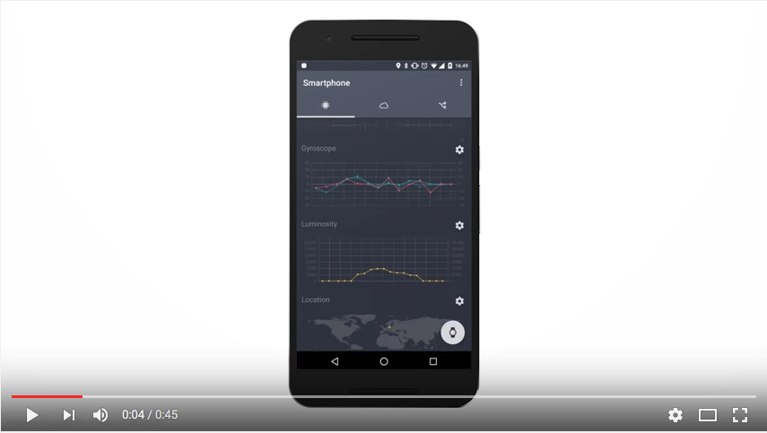

# Android Proto IoT

Welcome to Proto IoT, an open-source Android app for rapid Internet of
Things prototyping!

## Table of Contents

1.  [Introduction](#introduction)
2.  [Android & Java SDK reference](#android--java-sdk-reference)
3.  [Using the app](#using-proto-iot)  
  1.  [Setting it up on your device](#setting-it-up-on-your-device)
  2.  [Viewing device data](#viewing-device-data)
  3.  [How data is transferred](#how-data-is-transferred)
  4.  [Rules](#rules)
4.  [Developing the app](#developing-the-app)
5.  [Other resources](#other-resources)

## Introduction

Proto IoT turns your smartphone into a cloud-connected IoT device by measuring
sensor data from your device (_e.g._ touch, battery, wifi signal) and sending
it to the cloud over a secure MQTT connection. You can interact with your
device and view the data in the [relayr Developer
Dashboard](http://developer.relayr.io).

Using Proto IoT, you can:

-  Access sensor data easily and securely from anywhere with an internet connection.
-  Send readings from your device's sensors to the relayr cloud and interact with them remotely through the Dashboard.
-  Add interactions and rules on top of your sensors’ data in order to trigger actions on separate devices via the mobile app or the Dashboard.
-  Build and demonstrate IoT prototype solutions quickly, using just a smartphone.
-  View historical data from your devices.
-  Connect your wearable to the Internet of Things.
-  Trigger your device's actuators.

[**Download on Google Play**](https://play.google.com/store/apps/details?id=io.relayr.iotsmartphone&hl=en)

Proto IoT is open-source, so if you are a developer, take a look under the
hood or connect your own application through [relayr’s RESTful API](http://docs.relayr.io/api).

## Android & Java SDK reference

Proto IoT uses relayr's [Java](https://relayr.github.io/java-sdk/) and
[Android](https://github.com/relayr/android-sdk) SDKs in order to interact
with the relayr cloud.

## Using the app

### Setting it up on your device

Before you can connect your device to the cloud, you'll need a relayr
Developer Dashboard account. You can register one either [by visiting the
Dashboard](http://developer.relayr.io) or through the app as described below.

To connect your phone to the cloud:

1.  Open the Proto IoT app and click the cloud icon.
2.  In the first section labeled "Establish connection with the relayr Cloud," click **Log in**.
3.  On the login screen, if you don't have an account yet, switch to the **Create an account** tab, fill in the account details and click **Create account**. Otherwise, enter your account credentials and click **Log in.**

At this point, you're all set! Your device will begin pushing sensor data to the cloud.

### Viewing device data

You can see the data measured by your smartphone's sensors on the _smartphone
tab_, which is the first tab you see when you open the app. It's the leftmost
tab at the top, denoted by a chip icon. On this tab, you can see the following
data readings:

-  **Acceleration**: Measures the rate of your smartphone's acceleration among the x, y and z axes, in `m/s²`.
-  **Gyroscope**: Measures the angular tilt of your smartphone, in `m/s²`.
-  **Luminosity**: Measures the amount of light reaching your smartphone's screen, in `lux`.
-  **Location**: Records your phone's physical location.  
  _NOTE:_ The Proto IoT app requires permission to use your device's location. You can double-check to make sure this is enabled under Settings > Apps > relayr Proto IoT > Permissions.
-  **Screen touch**: Records every instance when your phone's screen is touched.
-  **Battery**: Measures your phone's battery percentage.
-  **WiFi signal**: Measures the strength of your phone's WiFi signal relative to the wifi network, in `dBi`. The signal strength is measured on a scale of -120 (worst connection) to 0 (best connection).

### How data is transferred

By default, data measured by your smartphone will be sent to the cloud through
your relayr user account. If you'd prefer to keep the data stored locally on
the smartphone, you can tap the gear icon to the right of each data reading
and set the **Data** value to **keep local**.

Data from your smartphone is sent to the relayr cloud in the form of **data
readings**. A reading is a JSON object that contains a `meaning` (the name of
what's being measured, _e.g._ acceleration), a `value` (the value of what was
measured), and an optional `path` (which differentiates between multiple
readings with the same meaning).

Here is an example of the schema received by the cloud for an acceleration
reading:

```
{
    "deviceId": "6e2aa661-02hg-4ee0-aa0f-e042eed1eda7",			// Your device's relayr cloud UUID.
    "readings": [										// Array of readings.
        {
            "path": "/",
            "meaning": "acceleration",				// Name of the value that's being measured.
            "value": {								// Value schema of the acceleration reading.
                "x": 5.0699997,
                "y": 6.04,
                "z": 8.25
            },
            "recorded": 1467812771620,				// Timestamp from when your device recorded the reading.
            "received": "2016-07-06T13:46:13.642Z"
        }
    ],
    "received": 1467812773560
}
```

Commands and configurations follow a similar pattern, except that their names
are specified by a `name` property instead of `meaning`:

```
"commands": [
    {
        "name": "vibration",
        "path": "",
        "valueSchema": {
            "type": "boolean"
        }
    }
]
```

### Rules

The Rules feature of the Proto IoT app lets you define a set of conditions that execute a command on your device. For instance, in the current configuration, you could create a rule to play a sound when your smartphone's battery reaches a low percentage.

To define a rule:

1.  Go to the **rules** tab (the icon farthest to the right).
2.  On the rules tab, tap the plus icon under "Conditions."
3.  Choose the reading from the list that will trigger the new rule.
4.  When you've chosen the reading, you can then define the value that will trigger the rule. First, choose a comparison operator (_e.g._ >, >=, ==) and then enter a value (_e.g._ 50).
5.  Additional conditions can be added by tapping the plus icon under the condition you just created. You can also define whether the conditions have an "and" relationship (_i.e._ both conditions must be met) or an "or" relationship by tapping the white icon between the two conditions.
6.  When you've finished adding conditions, tap the plus icon under "Outcomes."
7.  Choose a command from the list that will execute when the above condition(s) is/are met.

The rule will be saved, and the command(s) will execute when the condition(s) is/are met.

## Other resources

[Introducing Proto IoT](http://blog.relayr.io/engineering/introducing-proto-iot-for-android)

[Example project](https://github.com/bernardpletikosa/droidcon-workshop-2016)

**YouTube: Introducing Proto IoT for Android**

[](https://www.youtube.com/watch?v=s55vkryfQSY "Introducing Proto IoT for Android | relayr")